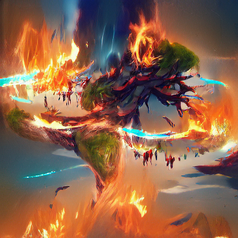

Passages that are ***italicized and bold*** are related to lore and the "flavor" of the game. Choose someone in your group to read them aloud...

***The Inferno that has always filled the void as the barrier between the World Trees grows and the World Trees burn. The magical energies of creation and destruction bleed into the World Trees.

The Adventurers dream of the World Trees burning. They heed this call to adventure and take their first steps in their stories. *** 
